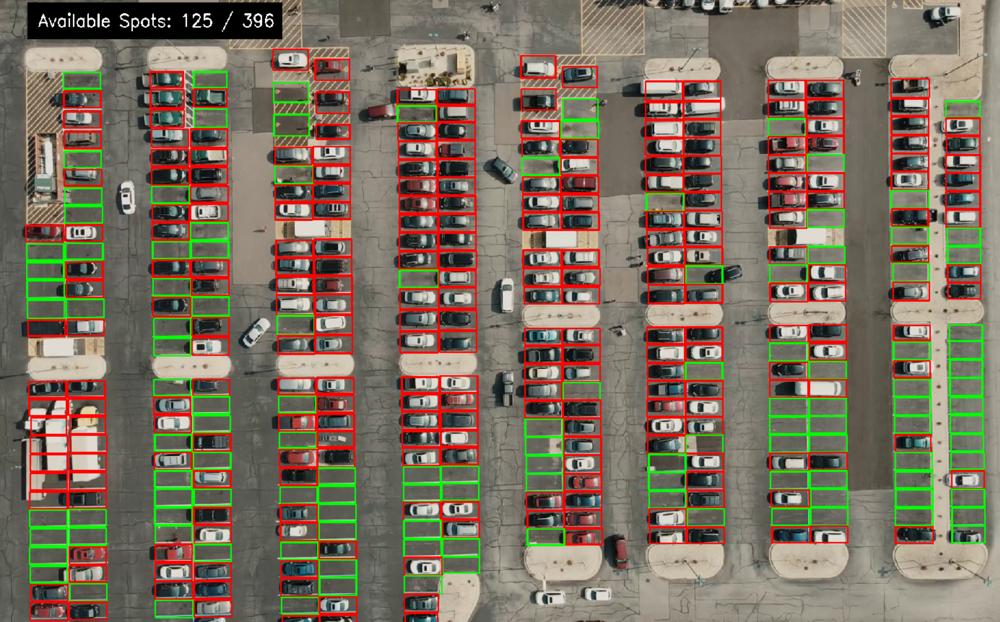

# 🚗 Parking Spot Counter

This project combines **Computer Vision (CV)** and **Large Language Models (LLMs)** to automatically monitor parking lot occupancy from video streams and generate **structured analytical reports** in Markdown format.

The system detects occupied and available parking spaces in real time, tracks occupancy trends, and produces human-readable insights and operational recommendations.

---

## 🔍 Features

- **Real-time Parking Space Detection**  
  Identifies occupied and free parking spots from video using a classical CV pipeline and an SVC classifier.

- **Occupancy Tracking & Statistics**  
  Computes total capacity, occupancy rate, and availability over time.

- **LLM-Powered Analysis**  
  Uses **Qwen3-Instruct** to generate concise yet informative Markdown reports, including:
  - Current status snapshots  
  - Operational insights  
  - Risk assessment  
  - Actionable recommendations  

- **Automated Markdown Reporting**  
  Periodically generates a structured `Parking_Report.md` file suitable for monitoring, documentation, or decision support.

---

## ⚙️ System Pipeline

1. **Video Input**  
   A fixed camera records the parking lot.

2. **Parking Spot Localization**  
   Parking spot bounding boxes are extracted from a predefined mask.

3. **Occupancy Classification**  
   Each spot is classified as occupied or available using image statistics and an SVC model.

4. **Temporal Monitoring**  
   Occupancy changes are tracked across frames to reduce noise and false updates.

5. **LLM Report Generation**  
   At fixed intervals, the system summarizes the parking status using an LLM and appends it to a Markdown report.

---

## 🎥 Example Output

The processed video highlights parking spots in real time:

  

---

## 📄 Generated Report

A detailed Markdown report is automatically generated during execution:

- **File:** `Parking_Report.md`
- Includes:
  - Timestamped occupancy tables  
  - Per-interval analytical summaries  
  - Risks and recommendations based on observed usage  

---

## 🚀 Applications

- Smart parking systems  
- Urban mobility monitoring  
- Facility management dashboards  
- Edge-AI + LLM experimentation  

---

## 🧠 Key Takeaway

This project demonstrates how **classical Computer Vision** can be effectively combined with **modern LLMs** to move from raw visual data to **interpretable, decision-oriented insights**.
